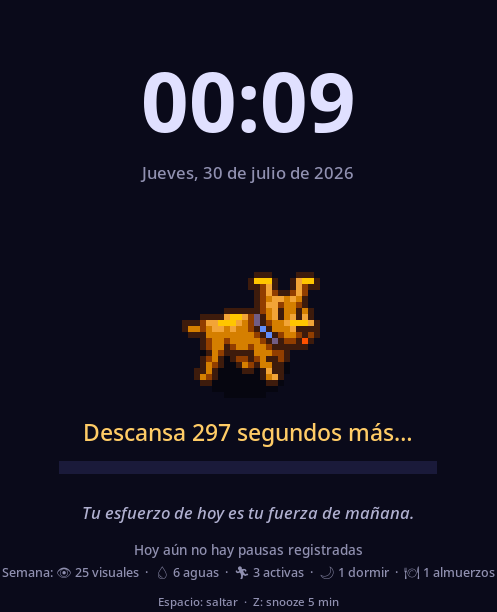
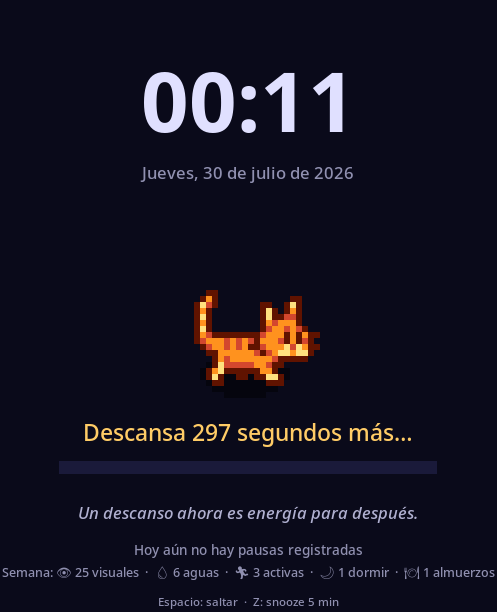
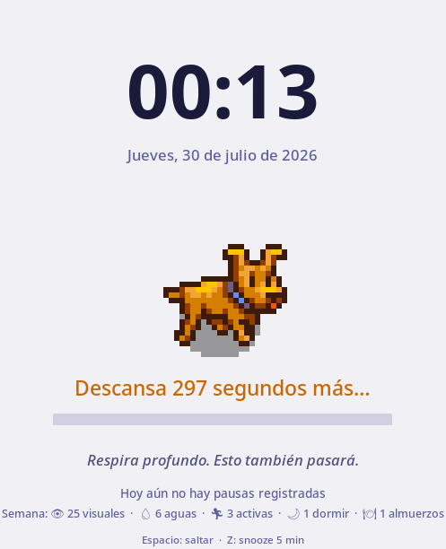

# Descanso Visual

Recordatorios automáticos de pausas para cuidar tus ojos, moverte e hidratarte.
Dos versiones que comparten la misma idea:

- **Escritorio** — un solo script en **Python + tkinter**, corre igual en
  Linux, macOS y Windows. Bloquea la pantalla con una pausa animada.
- **Android** — app nativa en **Kotlin** que te avisa con una notificación
  full-screen, aunque la app esté cerrada o el teléfono bloqueado.

| | Escritorio | Android |
|---|---|---|
| Recordatorios | visual, activo, agua, almuerzo, dormir | los mismos cinco, activables por separado |
| Pantalla de pausa | bloqueo con ASCII art animado | full-screen con cuenta regresiva |
| Posponer / saltar | Z (snooze 5 min) / Espacio | botones en pantalla |
| Pausar recordatorios | — | botón Pausar / Reanudar |
| Estadísticas | hoy, semana y total | hoy, semana con gráfico de 7 días, total y racha |
| Configuración | `config.json` | botón ⚙ en la app |
| No molestar | — | franja horaria configurable |
| Sobrevive reinicio | systemd / inicio de sesión | sí (arranca tras reboot) |
| Idioma | ES / EN automático | ES |

El historial de versiones está en [CHANGELOG.md](CHANGELOG.md).

---

## Escritorio (Python)

Un solo script — corre directo desde la carpeta clonada, sin compilar nada.

<table>
<tr>
<td></td>
<td></td>
<td></td>
</tr>
</table>

### Características

- **5 modos**: visual (20 min), activo (60 min), agua (30 min), almuerzo (12:00), dormir (22:30)
- **Pixel art animado**: perro o gato en `sprites/<animal>/`, con un ciclo de caminata real de 4 cuadros; si no hay sprites, cae al ASCII art clásico
- **Teclas**: Espacio saltar, Z snooze 5 min, Escape cerrar, Enter desbloquear
- **Sonido**: beep al iniciar cada pausa (ffplay o winsound)
- **Música lo-fi**: opcional durante las pausas
- **Tema claro/oscuro**: auto (según hora) o manual
- **Estadísticas**: hoy y semana, mostradas en pantalla y logs
- **Clima**: muestra el clima actual (configura `weather_city`)
- **Mensajes personalizados**: edita `messages.json`
- **Idioma**: español o inglés, detectado del sistema (o fija `language` en la config)

### Instalación

Requiere **Python 3.8+** con `tkinter`. En la mayoría de distros Linux viene
aparte del intérprete base:

```bash
sudo dnf install python3-tkinter   # Fedora
sudo apt install python3-tk        # Debian/Ubuntu
```

En macOS y Windows el instalador oficial de python.org ya lo incluye.

No hay dependencias de pip — todo el script usa librería estándar
(`tkinter`, `json`, `urllib`, etc.), así que no hace falta `requirements.txt`
ni entorno virtual. La única dependencia opcional es un binario externo,
**`ffplay`** (parte de [ffmpeg](https://ffmpeg.org)), para el beep y la
música lo-fi; sin él la app funciona igual, solo sin sonido.

```bash
git clone git@github.com:bramendev/descansa-pls.git
cd descansa-pls
python3 descanso   # Linux/macOS
python descanso    # Windows
```

Eso es todo — sin copiar nada ni compilar nada. En el primer arranque se crea
`~/.config/descanso-visual/config.json` con los valores por defecto (ver
[Configuración](#configuración)); si quieres partir de una plantilla con
comentarios, copiá `config.example.json` y `messages.example.json` del repo
a esa carpeta antes de arrancar.

#### Con uv (opcional)

Con [uv](https://docs.astral.sh/uv/) no hace falta instalar Python ni
`tkinter` a mano: uv descarga un Python autocontenido (con Tk incluido) la
primera vez que corrés el script, y como el proyecto no tiene dependencias
de pip, no hay nada más que resolver.

```bash
# instalar uv, una sola vez
curl -LsSf https://astral.sh/uv/install.sh | sh                      # Linux/macOS
powershell -ExecutionPolicy ByPass -c "irm https://astral.sh/uv/install.ps1 | iex"  # Windows

git clone git@github.com:bramendev/descansa-pls.git
cd descansa-pls
uv run python3 descanso   # Linux/macOS
uv run python descanso    # Windows
```

Cualquier comando de este README que empiece con `python3`/`python` funciona
igual anteponiendo `uv run` — incluido el auto-inicio de más abajo.

#### Auto-inicio y persistencia (opcional)

La app no es un servicio en segundo plano sin interfaz: la pausa es una
ventana de tkinter, así que necesita una sesión gráfica activa para
mostrarse. "Dejarla corriendo siempre" en la práctica significa que arranque
sola cada vez que iniciás sesión, sin que tengas que acordarte — sobrevive
apagados y reinicios porque se relanza sola en cada login.

- **Linux (systemd, recomendado):**
  ```bash
  cp descanso ~/.local/bin/
  cp pantalla-descanso ~/.local/bin/
  cp -r sprites ~/.local/bin/        # pixel art (opcional; sin esto usa ASCII)
  cp descanso.service ~/.config/systemd/user/
  systemctl --user daemon-reload
  systemctl --user enable --now descanso
  journalctl --user -u descanso -f   # logs
  ```
  `Restart=on-failure` en `descanso.service` ya hace que se relance solo si
  el proceso muere. Si querés que arranque apenas enciende el equipo, incluso
  antes de iniciar sesión gráficamente (por ejemplo con auto-login), activá
  linger una vez: `loginctl enable-linger $USER`.

  Para usar el Python de uv en lugar del Python del sistema, cambiá la línea
  `ExecStart` de `descanso.service` por:
  ```ini
  ExecStart=/home/TU_USUARIO/.local/bin/uv run python3 /home/TU_USUARIO/.local/bin/descanso
  ```

- **Windows (Programador de tareas, recomendado sobre la carpeta de inicio
  porque reintenta solo si falla):**
  1. Abrí **Programador de tareas** → *Crear tarea básica*.
  2. Desencadenador: **Al iniciar sesión**.
  3. Acción: **Iniciar un programa**, con estos tres campos:
     | Campo | Sin uv | Con uv |
     |---|---|---|
     | Programa/script | `pythonw.exe` | ruta a `uv.exe` |
     | Argumentos | `descanso` | `run python descanso` |
     | Iniciar en | `C:\ruta\a\descansa-pls` | `C:\ruta\a\descansa-pls` |
  4. En **Configuración**, marcá *"Si la tarea falla, reiniciar cada:"* y
     poné 1 minuto, para que se recupere sola si se cierra.

  Alternativa rápida y sin reintentos: `Win+R` → `shell:startup` → acceso
  directo apuntando a `pythonw.exe C:\ruta\a\descansa-pls\descanso`.

### Controles en pantalla

| Tecla | Acción |
|---|---|
| `Espacio` | Saltar pausa actual |
| `Z` | Snooze: pospone la próxima pausa 5 min |
| `Enter` | Desbloquear (cuando el timer termina) |
| `Escape` | Cerrar (cuando el timer termina o modos sin timer) |

### Configuración

Editar `~/.config/descanso-visual/config.json`:

```json
{
  "visual_interval_min": 20,
  "visual_duration_sec": 30,
  "active_interval_min": 60,
  "active_duration_sec": 180,
  "water_interval_min": 30,
  "water_duration_sec": 10,
  "lunch_time": "12:00",
  "sleep_time": "22:30",
  "music_url": "https://streams.fluxfm.de/lofi/mp3-128/",
  "animal": "perro",
  "theme": "dark",
  "weather_city": "",
  "sound": true,
  "language": "auto"
}
```

`language` acepta `"auto"` (detecta español o inglés del sistema),
`"es"` o `"en"` para forzarlo.

### Modos de pantalla

| Modo | Cuándo | Duración |
|---|---|---|
| Visual | Cada 20 min | 30s |
| Activo | Cada 60 min | 3 min |
| Agua | Cada 30 min | 10s |
| Almuerzo | 12:00 | 10 min auto |
| Dormir | 22:30 | 10 min auto |

### Archivos de configuración

| Archivo | Ubicación |
|---|---|
| Configuración | `~/.config/descanso-visual/config.json` |
| Mensajes custom | `~/.config/descanso-visual/messages.json` |
| Estadísticas | `~/.config/descanso-visual/stats.json` |
| Snooze flag | `~/.config/descanso-visual/snooze_until` |
| Cache clima | `~/.config/descanso-visual/weather_cache` |

---

## Android (Kotlin)

App ligera que agenda el próximo descanso con una alarma exacta (atraviesa
Doze) y lo dispara como notificación full-screen, aunque la app esté cerrada
o la pantalla bloqueada.

### Características

- **Cinco modos** activables por separado, cada uno con su intervalo, su
  duración y sus tips:

  | Modo | Cadencia por defecto | Activo de fábrica |
  |---|---|---|
  | 👀 Descanso visual | cada 20 min | sí |
  | 💧 Hidratación | cada 30 min | no |
  | 🏃 Pausa activa | cada 60 min | no |
  | 🍽 Hora de almorzar | a las 12:00 | no |
  | 🌙 Hora de dormir | a las 22:30 | no |

- **Configuración** con el botón ⚙: modos, intervalos, duraciones, horas fijas,
  vibración, tips propios y horario de silencio
- **No molestar** (22:00–8:00 por defecto): los avisos que caerían dentro se
  corren al final de la franja. La hora de dormir es la excepción a propósito
- **Pantalla de pausa** con cuenta regresiva, tip aleatorio y vibración
- **Posponer 5 min** o **Saltar** desde la propia pausa
- **Pausar / Reanudar** todos los recordatorios desde la pantalla de inicio
- **Estadísticas**: hoy, semana y total, gráfico de barras de los 7 días y
  **racha** de días seguidos
- **Notificación fija** con la cuenta atrás al próximo descanso, llevada por el
  cronómetro del sistema (no gasta batería refrescándose)
- **Sobrevive al reinicio** del teléfono y a las actualizaciones de la app

### Instalar

Descarga el `app-debug.apk` de la última
[Release](https://github.com/bramendev/descansa-pls/releases) e instálalo
(activa "instalar apps de orígenes desconocidos"). Cada tag `v*` publica un
APK automáticamente vía GitHub Actions, con las notas sacadas del
[CHANGELOG](CHANGELOG.md).

> **Nota de seguridad**: el APK publicado se compila con `assembleDebug`, así
> que va firmado con la clave de depuración de Android, que es pública y la
> misma para todo el mundo. Cualquiera puede firmar un APK con esa clave y
> Android lo aceptaría como actualización de este. Para una distribución seria
> hace falta un `assembleRelease` firmado con un keystore propio guardado en
> los secrets del repositorio.

### Compilar

```bash
gradle -p android assembleDebug
# APK en android/app/build/outputs/apk/debug/app-debug.apk
```

Requiere JDK 17 y Gradle 8.7. En el primer uso, Android pedirá permiso de
notificaciones y de alarmas exactas.
